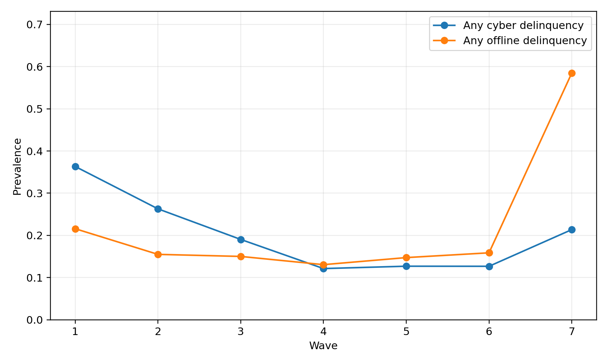
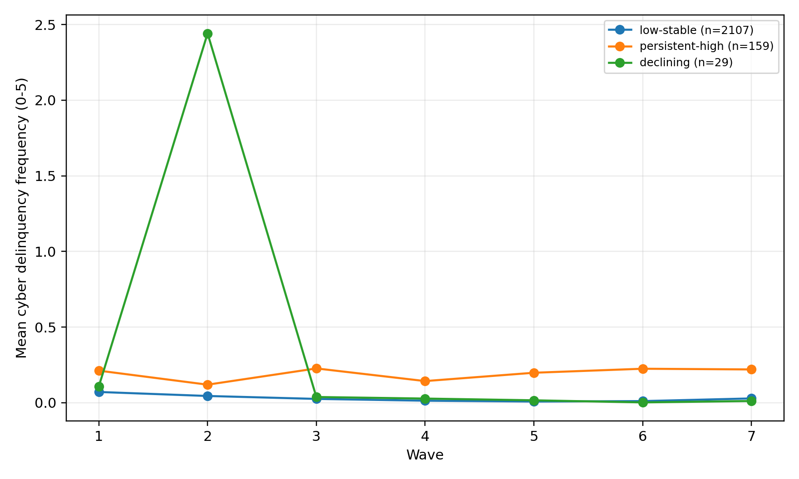
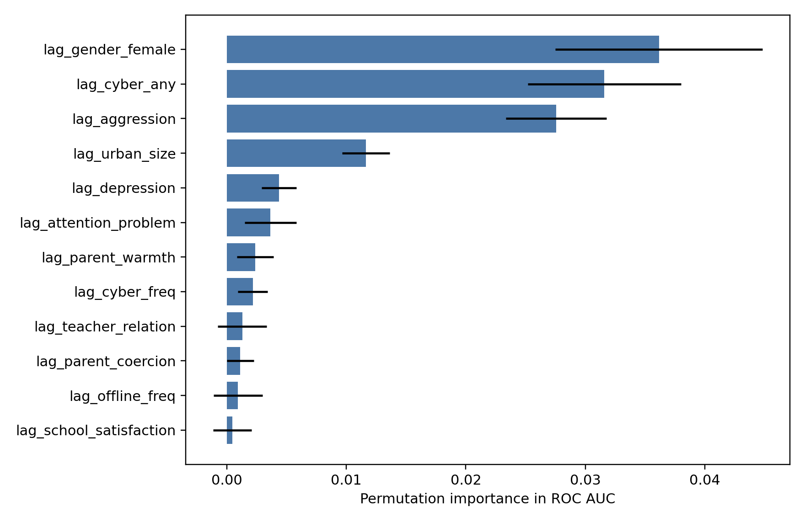

# KCYPS 2018 중1 코호트 1~7차 패널 분석: SSCI급 논문 설계와 예비결과

## 1. 데이터와 설계
- 자료: `KCYPS 2018` 중1 코호트 원패널 청소년(Y) 및 보호자(P) 1~7차 DTA, 유저가이드 2025.12판, 코드북 Excel.
- 분석 단위: 청소년 개인-파형 패널. 청소년 파일은 각 파형 2,590행으로 구성되어 있으며, 문항 비응답/미참여는 구성척도 산출에서 제외했다.
- 유저가이드 기준 표집틀은 2018년 초4·중1 재학생이며, 지역과 도시규모를 층화축으로 한 다단계층화집락추출 설계다. 중1 코호트 원패널은 2,590명이고 7차 조사 완료자는 2,073명, 유지율은 80.0%다.
- 코드에는 횡단면 표준화 가중치와 종단면 표준화 가중치가 포함되어 있어, 본문 결과는 비가중 예비결과로 제시하고 기술통계에는 가중 prevalence를 함께 산출했다.
- 핵심 결과변수: 현실비행 15문항과 사이버비행 15문항을 각각 0~5 빈도 지수와 경험 여부로 재코딩했다.
- 핵심 설명변수: 스마트폰 의존, 부모 양육태도, 또래/교사관계, 정서문제, 자아존중감, 그릿, 학업태도, SES.

## 2. 가장 강한 논문 아이디어
**Adolescent cyber delinquency as a developmental cascade:** 스마트폰 의존과 정서·관계 요인이 현실비행과 독립적으로 사이버비행의 청소년기 변화와 이행을 예측하는가?
이 주제가 유망한 이유는 7개 파형 전체에 사이버비행 15문항이 반복 측정되어 있고, 스마트폰 의존·정서문제·부모/또래/교사 관계도 같은 기간 반복 측정되어 패널 고정효과, 교차지연 예측, 궤적군집, 머신러닝 예측을 한 논문 안에 결합할 수 있기 때문이다.

## 3. 기술통계 핵심
|   wave |   n_rows |   n_cyber_valid |   n_offline_valid |   cyber_any |   offline_any |   cyber_freq_mean |   offline_freq_mean |   smartphone_dependence |   depression |   aggression |   parent_rejection |   negative_peer |   weighted_cyber_any |   weighted_offline_any |
|-------:|---------:|----------------:|------------------:|------------:|--------------:|------------------:|--------------------:|------------------------:|-------------:|-------------:|-------------------:|----------------:|---------------------:|-----------------------:|
|  1.000 | 2590.000 |        2590.000 |          2590.000 |       0.363 |         0.216 |             0.082 |               0.049 |                   2.039 |        1.799 |        1.917 |              1.767 |           1.854 |                0.350 |                  0.207 |
|  2.000 | 2590.000 |        2438.000 |          2438.000 |       0.263 |         0.155 |             0.088 |               0.067 |                   2.135 |        1.774 |        1.905 |              1.834 |           1.847 |                0.268 |                  0.157 |
|  3.000 | 2590.000 |        2384.000 |          2384.000 |       0.190 |         0.150 |             0.040 |               0.038 |                   2.184 |        1.791 |        1.861 |              1.831 |           1.799 |                0.194 |                  0.156 |
|  4.000 | 2590.000 |        2265.000 |          2265.000 |       0.121 |         0.131 |             0.023 |               0.024 |                   2.160 |        1.787 |        1.851 |              1.818 |           1.796 |                0.132 |                  0.134 |
|  5.000 | 2590.000 |        2252.000 |          2252.000 |       0.127 |         0.147 |             0.021 |               0.028 |                   2.187 |        1.806 |        1.890 |              1.878 |           1.873 |                0.129 |                  0.152 |
|  6.000 | 2590.000 |        2224.000 |          2224.000 |       0.127 |         0.159 |             0.025 |               0.031 |                   2.147 |        1.774 |        1.796 |              1.858 |           1.835 |                0.131 |                  0.169 |
|  7.000 | 2590.000 |        2073.000 |          2073.000 |       0.214 |         0.585 |             0.044 |               0.160 |                   2.106 |        1.690 |        1.738 |              1.831 |           1.783 |                0.188 |                  0.557 |

신뢰도(Cronbach alpha) 요약:
| scale                 |   mean |   min |   max |
|:----------------------|-------:|------:|------:|
| teacher_relation      |  0.917 | 0.898 | 0.967 |
| academic_engagement   |  0.917 | 0.903 | 0.929 |
| academic_helplessness |  0.916 | 0.907 | 0.924 |
| depression            |  0.908 | 0.896 | 0.922 |
| parent_warmth         |  0.876 | 0.847 | 0.913 |
| parent_autonomy       |  0.873 | 0.863 | 0.887 |
| positive_peer         |  0.870 | 0.846 | 0.897 |
| smartphone_dependence |  0.862 | 0.844 | 0.878 |
| aggression            |  0.844 | 0.832 | 0.857 |
| attention_problem     |  0.829 | 0.820 | 0.840 |
| self_esteem           |  0.816 | 0.766 | 0.867 |
| negative_peer         |  0.811 | 0.737 | 0.846 |
| life_satisfaction     |  0.798 | 0.745 | 0.851 |
| parent_rejection      |  0.793 | 0.751 | 0.811 |
| parent_inconsistency  |  0.785 | 0.752 | 0.804 |
| parent_structure      |  0.771 | 0.734 | 0.809 |
| parent_coercion       |  0.748 | 0.712 | 0.797 |
| cyber_frequency       |  0.721 | 0.511 | 0.928 |
| offline_frequency     |  0.682 | 0.563 | 0.949 |
| grit                  |  0.632 | 0.550 | 0.712 |

## 4. 패널 고정효과 결과
개인 고정효과와 파형 고정효과를 두고, t-1 시점의 표준화된 예측변수가 t 시점의 표준화된 비행 빈도를 예측하는 모형을 추정했다. 계수는 개인 내 변화 기준의 표준화 효과다. 짧은 패널에서 lagged outcome을 넣은 동적 FE는 평균회귀가 강하게 보일 수 있어, 직전 비행을 제외한 모형과 함께 해석한다.

직전 비행을 제외한 사이버비행 FE 모형:
| term                     |   coef_std |   se_cluster |     p |   n_obs |   n_ids |   r2_within |
|:-------------------------|-----------:|-------------:|------:|--------:|--------:|------------:|
| lag_teacher_relation     |      0.028 |        0.013 | 0.028 |   12994 |    2422 |       0.022 |
| lag_parent_income        |      0.041 |        0.019 | 0.032 |   12994 |    2422 |       0.022 |
| lag_academic_engagement  |     -0.022 |        0.016 | 0.179 |   12994 |    2422 |       0.022 |
| lag_attention_problem    |      0.019 |        0.016 | 0.239 |   12994 |    2422 |       0.022 |
| lag_aggression           |     -0.018 |        0.016 | 0.274 |   12994 |    2422 |       0.022 |
| lag_parent_coercion      |      0.013 |        0.016 | 0.409 |   12994 |    2422 |       0.022 |
| lag_grit                 |     -0.010 |        0.013 | 0.437 |   12994 |    2422 |       0.022 |
| lag_parent_inconsistency |     -0.010 |        0.014 | 0.450 |   12994 |    2422 |       0.022 |

사이버비행 상위 예측요인:
| term                      |   coef_std |   se_cluster | p     |   n_obs |   n_ids |   r2_within |
|:--------------------------|-----------:|-------------:|:------|--------:|--------:|------------:|
| lag_cyber_freq            |     -0.160 |        0.019 | <.001 |   12994 |    2422 |       0.067 |
| lag_offline_freq          |     -0.079 |        0.025 | 0.001 |   12994 |    2422 |       0.067 |
| lag_parent_education_max  |     -0.071 |        0.072 | 0.325 |   12994 |    2422 |       0.067 |
| lag_parent_income         |      0.031 |        0.019 | 0.100 |   12994 |    2422 |       0.067 |
| lag_teacher_relation      |      0.029 |        0.013 | 0.030 |   12994 |    2422 |       0.067 |
| lag_attention_problem     |      0.023 |        0.016 | 0.145 |   12994 |    2422 |       0.067 |
| lag_smartphone_dependence |      0.018 |        0.016 | 0.244 |   12994 |    2422 |       0.067 |
| lag_academic_engagement   |     -0.018 |        0.016 | 0.247 |   12994 |    2422 |       0.067 |

현실비행 상위 예측요인:
| term                      |   coef_std |   se_cluster | p     |   n_obs |   n_ids |   r2_within |
|:--------------------------|-----------:|-------------:|:------|--------:|--------:|------------:|
| lag_offline_freq          |     -0.155 |        0.027 | <.001 |   12994 |    2422 |       0.121 |
| lag_cyber_freq            |     -0.052 |        0.018 | 0.004 |   12994 |    2422 |       0.121 |
| lag_parent_education_max  |     -0.050 |        0.067 | 0.451 |   12994 |    2422 |       0.121 |
| lag_teacher_relation      |      0.038 |        0.013 | 0.003 |   12994 |    2422 |       0.121 |
| lag_life_satisfaction     |     -0.035 |        0.014 | 0.013 |   12994 |    2422 |       0.121 |
| lag_parent_income         |      0.034 |        0.018 | 0.051 |   12994 |    2422 |       0.121 |
| lag_academic_helplessness |      0.030 |        0.013 | 0.026 |   12994 |    2422 |       0.121 |
| lag_grit                  |     -0.024 |        0.013 | 0.071 |   12994 |    2422 |       0.121 |

## 5. 사이버비행 진입 위험모형
직전 파형에 사이버비행 경험이 없던 청소년만 위험집합으로 두고, 다음 파형의 새 사이버비행 경험 여부를 GEE logit으로 추정했다. 연속 예측변수는 표준화했으므로 OR은 1 SD 증가의 효과이며, 성별은 여학생=1이다.
| term                      |    OR |   ci_low |   ci_high | p     |   n_obs |   n_ids |   event_rate |
|:--------------------------|------:|---------:|----------:|:------|--------:|--------:|-------------:|
| lag_gender_female         | 0.566 |    0.499 |     0.641 | <.001 |   10374 |    2428 |        0.133 |
| lag_smartphone_dependence | 1.112 |    1.037 |     1.192 | 0.003 |   10374 |    2428 |        0.133 |
| lag_aggression            | 1.119 |    1.020 |     1.228 | 0.017 |   10374 |    2428 |        0.133 |
| lag_offline_freq          | 1.061 |    1.010 |     1.114 | 0.018 |   10374 |    2428 |        0.133 |
| lag_parent_rejection      | 1.089 |    1.012 |     1.172 | 0.023 |   10374 |    2428 |        0.133 |
| lag_parent_education_max  | 0.943 |    0.884 |     1.006 | 0.074 |   10374 |    2428 |        0.133 |
| lag_parent_coercion       | 1.059 |    0.981 |     1.143 | 0.143 |   10374 |    2428 |        0.133 |
| lag_academic_engagement   | 0.950 |    0.881 |     1.024 | 0.181 |   10374 |    2428 |        0.133 |
| lag_self_esteem           | 1.056 |    0.968 |     1.153 | 0.219 |   10374 |    2428 |        0.133 |
| lag_parent_income         | 0.975 |    0.913 |     1.041 | 0.451 |   10374 |    2428 |        0.133 |
해석: 남학생(여학생 OR<1), 높은 스마트폰 의존, 공격성, 직전 현실비행, 부모 거부가 사이버비행 진입 위험을 높이는 가장 일관적인 신호다.

## 6. 궤적군집
K-means 기반 반복측정 궤적군집을 2~6개 군으로 비교했고 silhouette를 기준으로 예비 군집 수를 선택했다.
|     k |   silhouette |   inertia |
|------:|-------------:|----------:|
| 2.000 |        0.678 | 13829.792 |
| 3.000 |        0.697 | 12054.453 |
| 4.000 |        0.509 | 10701.572 |
| 5.000 |        0.514 |  9418.152 |
| 6.000 |        0.518 |  8298.046 |

선택 군집별 사이버비행 평균 궤적:
|   cluster | cluster_label   |     1 |     2 |     3 |     4 |     5 |     6 |     7 |    n |   pct |
|----------:|:----------------|------:|------:|------:|------:|------:|------:|------:|-----:|------:|
|         0 | low-stable      | 0.071 | 0.045 | 0.025 | 0.014 | 0.008 | 0.011 | 0.029 | 2107 | 0.918 |
|         1 | persistent-high | 0.212 | 0.119 | 0.227 | 0.143 | 0.198 | 0.225 | 0.220 |  159 | 0.069 |
|         2 | declining       | 0.108 | 2.441 | 0.038 | 0.028 | 0.016 | 0.002 | 0.011 |   29 | 0.013 |

군집별 1차년도 위험요인 평균:
| cluster_label   |    n |   cyber_any |   offline_any |   smartphone_dependence |   depression |   aggression |   attention_problem |   parent_warmth |   parent_rejection |   parent_inconsistency |   negative_peer |   teacher_relation |   self_esteem |   grit |   academic_engagement |   parent_income |   parent_education_max |   gender_female |
|:----------------|-----:|------------:|--------------:|------------------------:|-------------:|-------------:|--------------------:|----------------:|-------------------:|-----------------------:|----------------:|-------------------:|--------------:|-------:|----------------------:|----------------:|-----------------------:|----------------:|
| low-stable      | 2107 |       0.340 |         0.197 |                   2.036 |        1.787 |        1.902 |               2.151 |           3.382 |              1.754 |                  2.035 |           1.841 |              2.805 |         3.001 |  2.664 |                 2.482 |           6.662 |                  5.346 |           0.477 |
| persistent-high |  159 |       0.623 |         0.384 |                   2.090 |        1.892 |        2.104 |               2.334 |           3.313 |              1.825 |                  2.079 |           1.925 |              2.746 |         2.936 |  2.583 |                 2.395 |           6.610 |                  5.170 |           0.314 |
| declining       |   29 |       0.414 |         0.345 |                   2.140 |        2.055 |        2.086 |               2.394 |           3.172 |              1.983 |                  2.112 |           2.090 |              2.670 |         2.783 |  2.453 |                 2.256 |           6.586 |                  4.857 |           0.517 |

## 7. 머신러닝 예측
1~5차 전이자료로 학습하고 6→7차 전이를 holdout test로 두어, 7차 사이버비행 경험 여부를 예측했다. 비교 지표는 ROC-AUC, average precision, Brier score다.
| model                  |   n_train |   n_test |   test_event_rate |   roc_auc |   average_precision |   brier |
|:-----------------------|----------:|---------:|------------------:|----------:|--------------------:|--------:|
| hist-gradient-boosting |     11563 |     2073 |             0.214 |     0.630 |               0.324 |   0.166 |
| lasso-logit            |     11563 |     2073 |             0.214 |     0.619 |               0.319 |   0.213 |
| random-forest          |     11563 |     2073 |             0.214 |     0.592 |               0.295 |   0.177 |
| lag-only               |     11563 |     2073 |             0.214 |     0.574 |               0.275 |   0.221 |

최상위 모형의 permutation importance:
| model                  | feature                   |   importance_mean |   importance_sd |
|:-----------------------|:--------------------------|------------------:|----------------:|
| hist-gradient-boosting | lag_gender_female         |            0.0361 |          0.0087 |
| hist-gradient-boosting | lag_cyber_any             |            0.0316 |          0.0064 |
| hist-gradient-boosting | lag_aggression            |            0.0276 |          0.0042 |
| hist-gradient-boosting | lag_urban_size            |            0.0116 |          0.0020 |
| hist-gradient-boosting | lag_depression            |            0.0044 |          0.0015 |
| hist-gradient-boosting | lag_attention_problem     |            0.0037 |          0.0022 |
| hist-gradient-boosting | lag_parent_warmth         |            0.0024 |          0.0015 |
| hist-gradient-boosting | lag_cyber_freq            |            0.0022 |          0.0012 |
| hist-gradient-boosting | lag_teacher_relation      |            0.0013 |          0.0021 |
| hist-gradient-boosting | lag_parent_coercion       |            0.0011 |          0.0011 |
| hist-gradient-boosting | lag_offline_freq          |            0.0009 |          0.0021 |
| hist-gradient-boosting | lag_school_satisfaction   |            0.0005 |          0.0016 |
| hist-gradient-boosting | lag_parent_rejection      |            0.0003 |          0.0016 |
| hist-gradient-boosting | lag_smartphone_dependence |            0.0002 |          0.0019 |
| hist-gradient-boosting | lag_academic_achievement  |           -0.0001 |          0.0003 |

## 8. 투고용 분석 설계
1. 측정: 15문항 사이버비행 지수와 현실비행 지수의 파형별 신뢰도와 불변성 점검.
2. 기술 분석: 성별/SES/학교유형별 추세, 가중치 적용 민감도.
3. 원인 추론에 가까운 패널 분석: 개인 고정효과 + 파형 고정효과 + lagged predictors.
4. 발달 이질성: LCGA/GMM 또는 본 예비분석의 군집을 바탕으로 잠재궤적모형 확정.
5. 예측 타당도: 시간차 holdout ML로 결과의 외적 예측 성능 제시.
6. 강건성: 현실비행 통제, 성별 상호작용, zero-inflated/negative-binomial 대체모형, 완전사례와 다중대체 비교.

## 9. 그림

